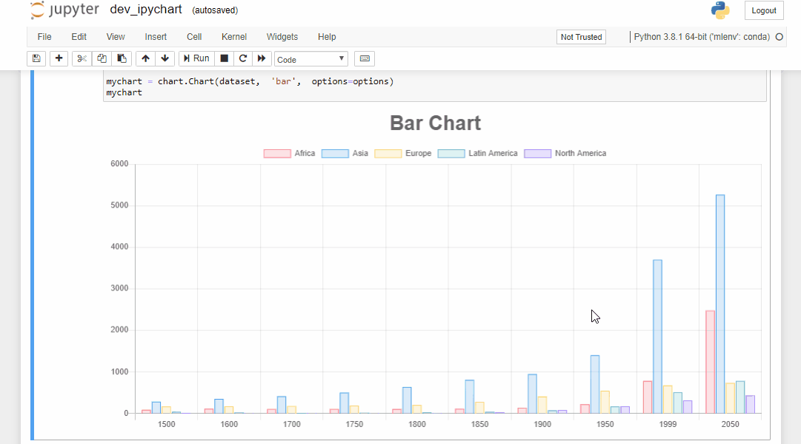

<p align="center">
    <br/>
    The power of Chart.js in Jupyter Notebooks
</p>

<p align="center">
</p>

Installation
------------

To install use pip:

```bash
$ pip install ipychart
```

Usage
------------

Create charts with python in a very similar way to creating charts using Chart.js ([create a bar chart using Chart.js](https://www.chartjs.org/docs/latest/charts/bar.html)):

```py
from ipychart import Chart

dataset = {
    'labels': [1500, 1600, 1700, 1750, 1800, 1850, 1900, 1950, 1999, 2050], 
    'datasets': [
        {'data': [86, 114, 106, 106, 107, 111, 133, 221, 783, 2478], 'label': 'Africa'}, 
        {'data': [282, 350, 411, 502, 635, 809, 947, 1402, 3700, 5267], 'label': 'Asia'}, 
        {'data': [168, 170, 178, 190, 203, 276, 408, 547, 675, 734], 'label': 'Europe'}, 
        {'data': [40, 20, 10, 16, 24, 38, 74, 167, 508, 784], 'label': 'Latin America'}, 
        {'data': [6, 3, 2, 2, 7, 26, 82, 172, 312, 433], 'label': 'North America'}
    ]
}

options = {'title': {'display': True, 'text': 'Bar Chart', 'fontSize': 30}}

mychart = Chart(dataset,  'bar',  options=options)
mychart
```

The charts created are fully configurable, interactive and modular and are displayed directly in the output of the the cells of your jupyter notebook environment:



Development Installation 
------------

For a development installation:

    $ git clone https://github.com/nicohlr/ipychart.git
    $ cd ipychart
    $ conda install jupyterlab nodejs -c conda-forge
    $ cd ipychart/js
    $ npm install 
    $ cd .. 
    $ pip install -e .
    $ jupyter nbextension install --py --symlink --sys-prefix ipychart
    $ jupyter nbextension enable --py --sys-prefix ipychart

References
------------

- [**Chart.js**](https://www.chartjs.org/)
- [**Vuepress**](https://vuepress.vuejs.org/)
- [**GitLab Pages**](https://docs.gitlab.com/ee/user/project/pages/)
- [**Ipywidgets**](https://ipywidgets.readthedocs.io/en/latest/index.html)
- [**Ipywidgets cookiecutter template**](https://github.com/jupyter-widgets/widget-cookiecutter)
- [**Article about custom ipywidgets**](https://blog.jupyter.org/authoring-custom-jupyter-widgets-2884a462e724)