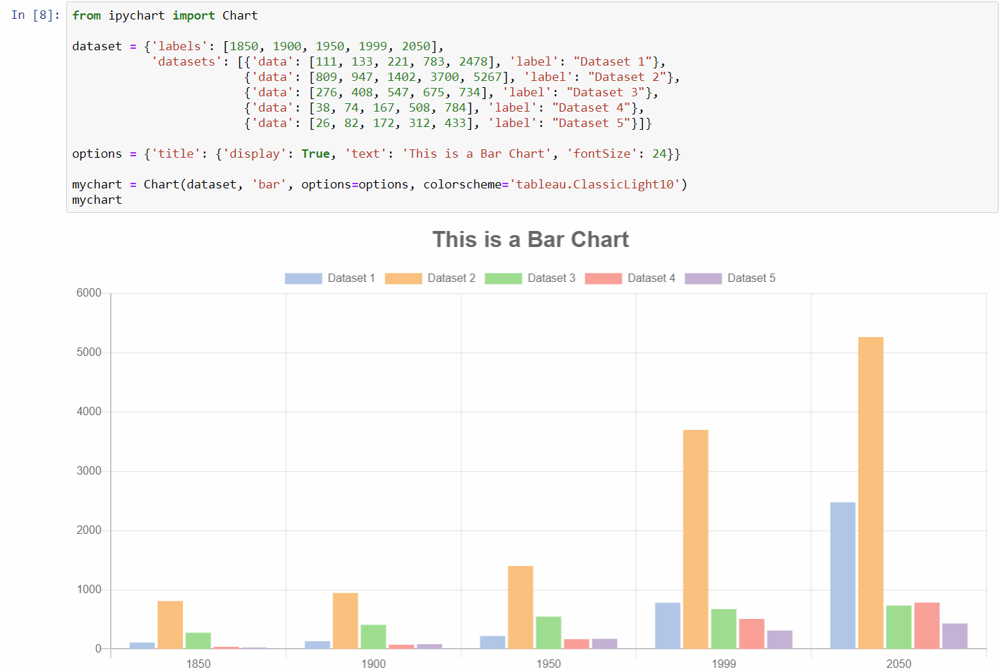

<p align="center">
    <br/>
    The power of Chart.js in Jupyter Notebooks
</p>

<p align="center">
    
    
    <a href="https://mybinder.org/v2/gh/nicohlr/ipychart-demo-notebooks/master">
        
    </a>
</p>

Installation
------------

You can install ipychart from your terminal using pip or conda:

```bash
# using pip
$ pip install ipychart

# using conda
$ conda install -c conda-forge ipychart
```

Documentation
------------

- [**Introduction**](https://nicohlr.gitlab.io/ipychart/user_guide/introduction.html)
- [**Getting Started**](https://nicohlr.gitlab.io/ipychart/user_guide/getting_started.html)
- [**Usage**](https://nicohlr.gitlab.io/ipychart/user_guide/usage.html)
- [**Charts**](https://nicohlr.gitlab.io/ipychart/user_guide/charts.html)
- [**Configuration**](https://nicohlr.gitlab.io/ipychart/user_guide/configuration.html)
- [**Scales**](https://nicohlr.gitlab.io/ipychart/user_guide/scales.html)
- [**Pandas Interface**](https://nicohlr.gitlab.io/ipychart/user_guide/pandas.html)
- [**Advanced Features**](https://nicohlr.gitlab.io/ipychart/user_guide/advanced.html)
- [**Developers**](https://nicohlr.gitlab.io/ipychart/developer_guide/development_installation.html)

Usage
------------

Create charts with Python in a very similar way to creating charts using Chart.js ([create a bar chart using Chart.js](https://nicohlr.gitlab.io/ipychart/user_guide/charts/bar.html)). The charts created are fully configurable, interactive and modular and are displayed directly in the output of the the cells of your jupyter notebook environment:



Development Installation 
------------

For a development installation:

    $ git clone https://github.com/nicohlr/ipychart.git
    $ cd ipychart
    $ conda install jupyterlab nodejs -c conda-forge
    $ cd ipychart/js
    $ npm install 
    $ cd .. 
    $ pip install -e .
    $ jupyter nbextension install --py --symlink --sys-prefix ipychart
    $ jupyter nbextension enable --py --sys-prefix ipychart

References
------------

- [**Chart.js**](https://www.chartjs.org/)
- [**Ipywidgets**](https://ipywidgets.readthedocs.io/en/latest/index.html)
- [**Ipywidgets cookiecutter template**](https://github.com/jupyter-widgets/widget-cookiecutter)
- [**Chart.js Datalabels**](https://github.com/chartjs/chartjs-plugin-datalabels)
- [**Chart.js Colorschemes**](https://github.com/nagix/chartjs-plugin-colorschemes)
- [**Vuepress**](https://vuepress.vuejs.org/)
- [**GitLab Pages**](https://docs.gitlab.com/ee/user/project/pages/)

License
------------

Ipychart is available under the [MIT license](https://opensource.org/licenses/MIT).